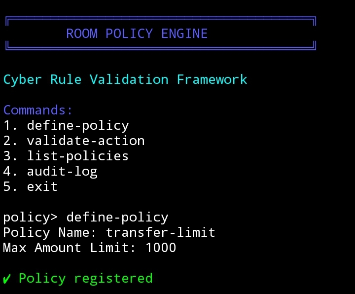
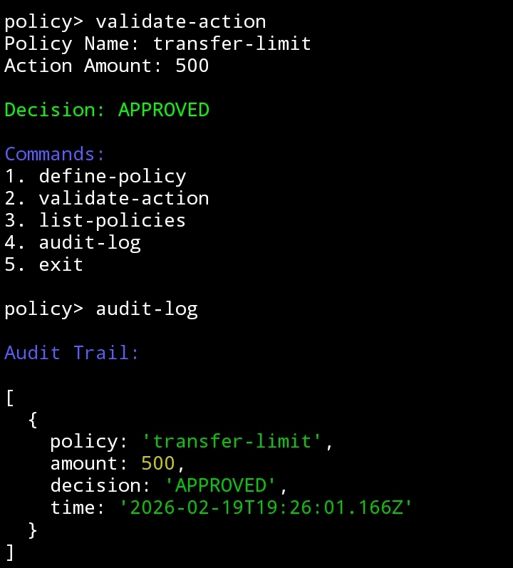

# 🧠 ROOM POLICY ENGINE

A cyber-style CLI policy validation engine built on Intercom architecture.

Room Policy Engine is a modular rule-based validation framework designed to simulate structured governance logic, transaction limits, and action approval systems inside a secure CLI environment.

---

## ⚡ Features

- 🔐 Dynamic policy definition
- 🧮 Action validation engine
- 📋 Policy listing system
- 🧾 Rule evaluation logging
- 🎨 Cyber-themed CLI UI (Blue / Red / Green)
- 🧱 Modular architecture
- 🔄 Intercom-based fork structure

---

## 🖥 Interface Design

Cyber-inspired UI layout:

- 🔵 Blue → System headers
- 🔴 Red → Policy alerts / limits
- 🟢 Green → Approved decisions
- ⚡ Clean structured CLI flow

---

## 🧩 Command Structure

1. `define-policy`  
2. `validate-action`  
3. `list-policies`  
4. `remove-policy`  
5. `exit`  

All commands execute in a structured policy environment.

---

## 🚀 Installation

```bash
git clone https://github.com/danielmushroom886-ai/room-policy-engine.git
cd room-policy-engine
npm install
node index.js
```

---

## 🧪 Proof of Execution

### 1️⃣ Policy Engine Running



---

### 2️⃣ Policy Validation – APPROVED



---

## 🏗 Example Execution Flow

Define a policy:

```
policy> define-policy
Policy Name: transfer-limit
Max Amount: 1000
```

Validate an action:

```
policy> validate-action
Policy Name: transfer-limit
Action Amount: 500

Decision: APPROVED
```

If exceeding limit:

```
Decision: REJECTED
```

---

## 🧠 Architecture Overview

Room Policy Engine follows a modular logic structure:

- Policy registry storage
- Validation handler
- CLI interface controller
- Rule evaluation layer

Built for deterministic execution and lightweight runtime performance.

---

## 🔗 Trac Address

```
trac1x4gch62ngr53x0yfh3glwvkhmalwa0wfxc5529re6kxza00ndlysnp3gz4
```

---

## 📜 License

MIT License

---

### 🔥 Room Policy Engine  
Cyber Rule Validation Framework
